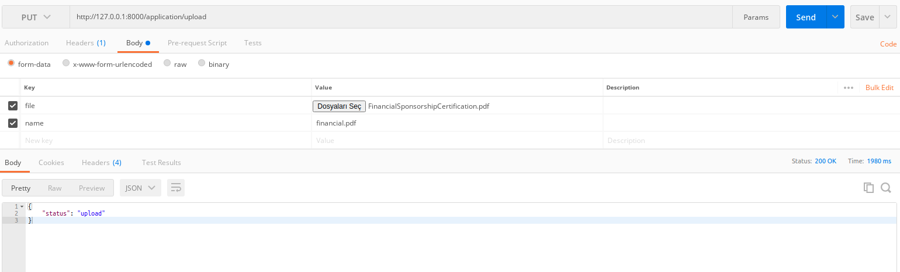

## How can deploy it?

- Make sure install aws-cli
- Check your `~/.aws/credentials`
- Change OAUTH_TOKEN  
  * path:`chalicelib/base_config`

## Deploying
 - If you run `chalice deploy` you can deploy to cloud
 - If you run with `chalice local` you can running on the localhost

## Endpoints
If you want to run on localhost:
`127.0.0.1:8000`
 - `/application/upload`
   * Method: Post
   * Body -> form-data
   * If you don't use name key in the form-data, we using uuid for the file naming.
 - `/application/download/{id}`
   * Method: GET
 - `/application/list`
   * Method: GET

Note: `If you want to test on cloud please add /api/ prefix on the applicaton`
Example: `blablabla.us-east-1.amazonaws.com/api/application/upload`

## Postman Test
#### Upload

#### Download
`http://127.0.0.1:8000/application/download/<ID>`

#### List
`http://127.0.0.1:8000/application/list`

## Unit Test
 - pip install pytest
 - py.test tests/test_app.py
